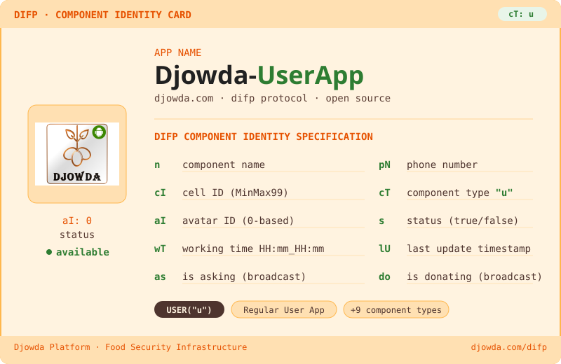

---

<!-- DIFP Component Type Registry -->

<b>DIFP Component Type Registry</b>

 

| Code | Type | Description |
|------|------|-------------|
| `u` | `USER` | **Regular User App** ← this component |
| `s` | `STORE` | Store App |
| `f` | `FARMER` | Farmer App |
| `fa` | `FACTORY` | Factory App |
| `w` | `WHOLESALER` | Wholesaler App |
| `r` | `RESTAURANT` | Restaurant App |
| `sp` | `SEED_PROVIDER` | Seed Provider App |
| `t` | `TRANSPORT` | Transport App |
| `d` | `DELIVERY` | Delivery Men App |
| `a` | `ADMIN` | Store Admin App |

---

> **Djowda** is a food security platform built on top of the [DIFP Protocol](https://djowda.com/difp).
> This repository is part of the Djowda open-source component suite.
