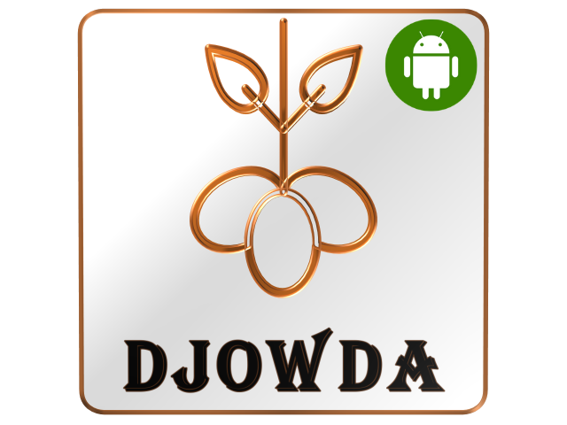

<!-- DJOWDA · DIFP COMPONENT IDENTITY CARD -->

<table>
  <tr>
    <td width="160" align="center" valign="top">
       
      
        
      <b>aI ·</b> 0
       
      🟢 available
        
    </td>
    <td valign="top" style="padding-left: 20px;">
       
      DIFP · COMPONENT IDENTITY CARD
      <h2>Djowda-UserApp</h2>
      
        <a href="https://djowda.com">djowda.com</a> ·
        <a href="https://djowda.com/difp">difp protocol</a> ·
        open source
      
        
      <b>DIFP Component Identity Specification</b>
        
      <table>
        <tr>
          <td><code>n</code></td>
          <td>Component name</td>
          <td><code>as</code></td>
          <td>Is asking (broadcasting ask for products)</td>
        </tr>
        <tr>
          <td><code>pN</code></td>
          <td>Phone number</td>
          <td><code>do</code></td>
          <td>Is donating (broadcasting donation offers)</td>
        </tr>
        <tr>
          <td><code>cI</code></td>
          <td>Cell ID (MinMax99 grid)</td>
          <td><code>s</code></td>
          <td>Status — <code>true</code> = available/open · <code>false</code> = unavailable/closed</td>
        </tr>
        <tr>
          <td><code>cT</code></td>
          <td>Component type code → <b><code>"u"</code></b></td>
          <td><code>wT</code></td>
          <td>Working time — format: <code>"HH:mm_HH:mm"</code></td>
        </tr>
        <tr>
          <td><code>aI</code></td>
          <td>Avatar ID (0-based index)</td>
          <td><code>lU</code></td>
          <td>Last update timestamp</td>
        </tr>
      </table>
       
      
        <code>USER("u")</code> · Regular User App · part of 10 DIFP component types
      
        
    </td>
  </tr>
</table>

---

<!-- DIFP Component Type Registry -->

<b>DIFP Component Type Registry</b>

 

| Code | Type | Description |
|------|------|-------------|
| `u` | `USER` | **Regular User App** ← this component |
| `s` | `STORE` | Store App |
| `f` | `FARMER` | Farmer App |
| `fa` | `FACTORY` | Factory App |
| `w` | `WHOLESALER` | Wholesaler App |
| `r` | `RESTAURANT` | Restaurant App |
| `sp` | `SEED_PROVIDER` | Seed Provider App |
| `t` | `TRANSPORT` | Transport App |
| `d` | `DELIVERY` | Delivery Men App |
| `a` | `ADMIN` | Store Admin App |

---

> **Djowda** is a food security platform built on top of the [DIFP Protocol](https://djowda.com/difp).
> This repository is part of the Djowda open-source component suite.